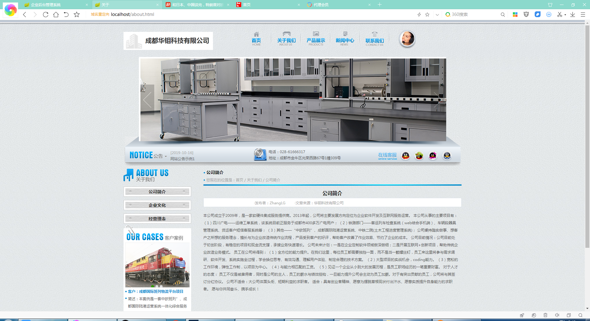
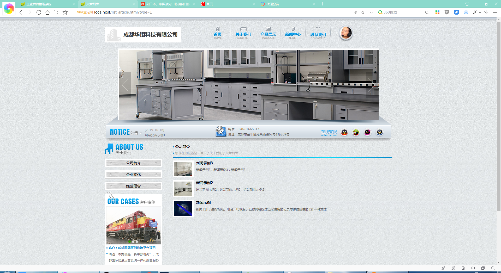
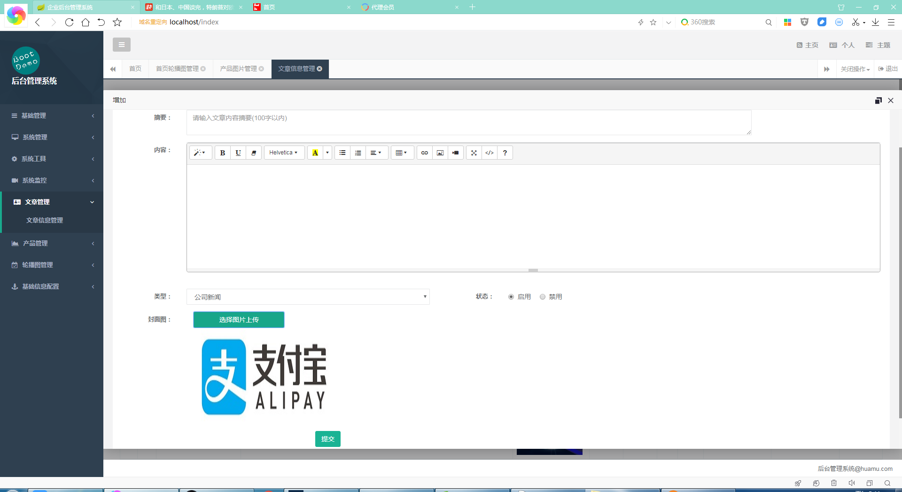
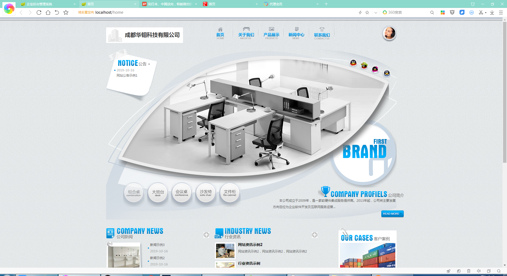

## 基于SpringBoot的企业门户前后端系统

- <b>完整代码获取地址：从戎源码网 ([https://armycodes.com/](https://armycodes.com/))</b>
- <b>技术探讨、资料分享，请加QQ群：692619798</b> 
- <b>作者微信：19941326836  QQ：952045282</b> 
- <b>承接计算机毕业设计、Java毕业设计、Python毕业设计、深度学习、机器学习</b>
- <b>选题+开题报告+任务书+程序定制+安装调试+论文+答辩ppt 一条龙服务</b>
- <b>所有选题地址 ([https://github.com/YuLin-Coder/AllProjectCatalog](https://github.com/YuLin-Coder/AllProjectCatalog)) </b>

## 项目介绍
基于SpringBoot的企业门户前后端系统，有用户和管理员两个角色，主要功能如下

### 【管理员】:
基础管理：文件管理
系统管理：用户管理、角色管理、系统菜单、部门管理
系统监控：在线用户、系统日志、运行监控
文章管理：文章信息管理、
产品管理：产品图片管理
轮播图管理：首页轮播图管理、轮播图类型管理

### 【前台】:
首页、关于我们、产品展示、新闻中心、联系我们

## 项目技术
- 编程语言：Java
- 数据库：MySQL
- 项目管理工具：Maven
- 前端技术：HTML、CSS、JavaScript、Jquery
- 后端技术：Spring、SpringMVC、MyBatis

## 运行环境
- JDK版本：JDK1.8及以上
- 开发工具：IDEA、Ecplise、Myecplise都可以
- 数据库: MySQL5.7及以上
- Maven：maven3.0及以上

## 运行截图

